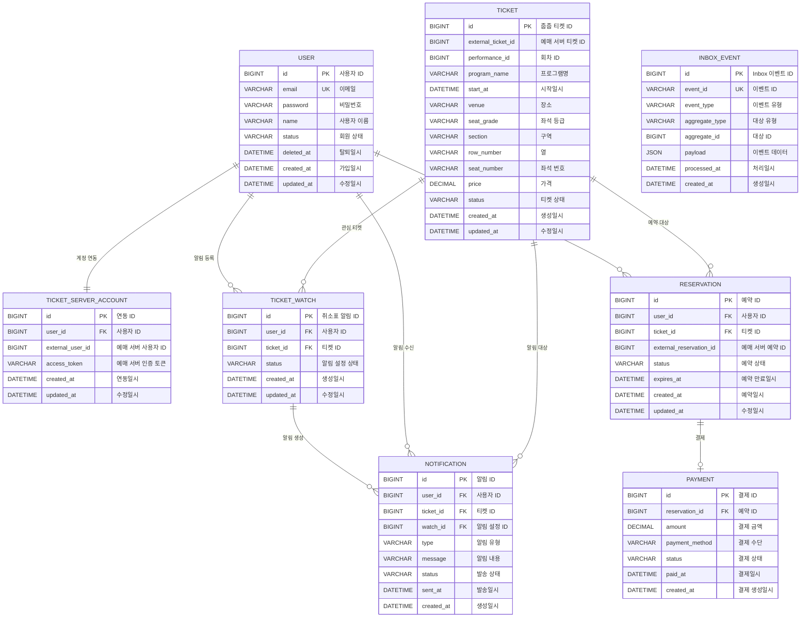
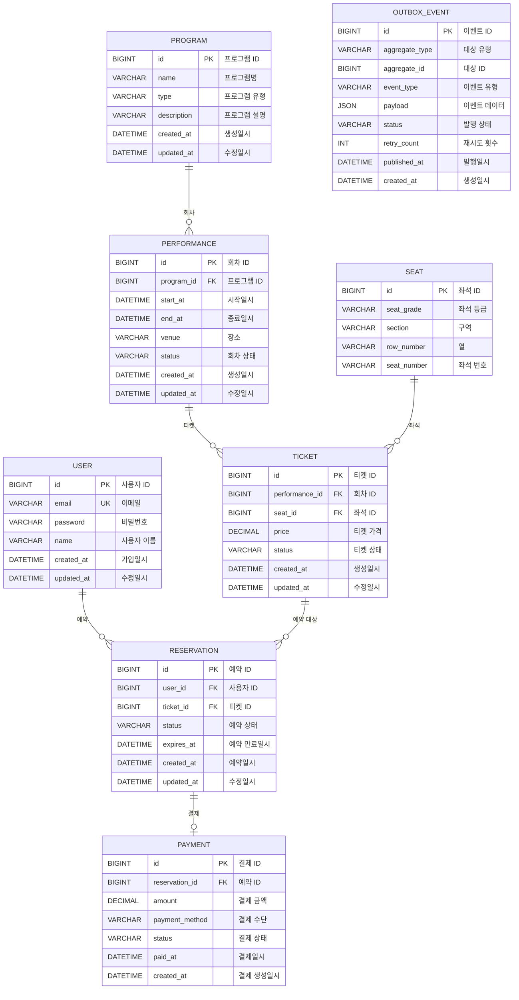

# 🎫 줍줍 (JupJup)

> 취소표를 실시간으로 감지하고, 사용자에게 알림을 제공하여  
> 빠르게 취소표를 예매할 수 있도록 도와주는 서비스

---

## 📌 프로젝트 소개

공연, 스포츠 경기, 기차 등의 예매에서 원하는 좌석이 매진된 경우  
사용자가 직접 반복적으로 예매 사이트를 확인해야 하는 불편함이 있습니다.

**줍줍**은 사용자가 원하는 티켓을 등록해두면 취소표 발생 여부를 감지하고,  
취소표가 발생했을 때 사용자에게 실시간으로 알림을 전달하여  
빠르게 예매할 수 있도록 지원하는 서비스입니다.

### 핵심 기능

- 회원가입 / 로그인
- 예매 서버 계정 연동
- 공연 및 티켓 조회
- 원하는 티켓 취소표 등록
- 취소표 발생 감지
- 취소표 실시간 알림
- 취소표 선착순 예매
- 결제
- 예약 내역 조회
- 예매/결제 상태 관리

---

# 🗄️ ERD

## 줍줍 서버 ERD

---

# 🎟️ 가상 예매 서버 ERD

