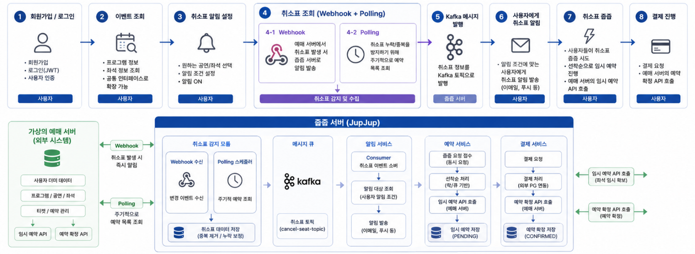
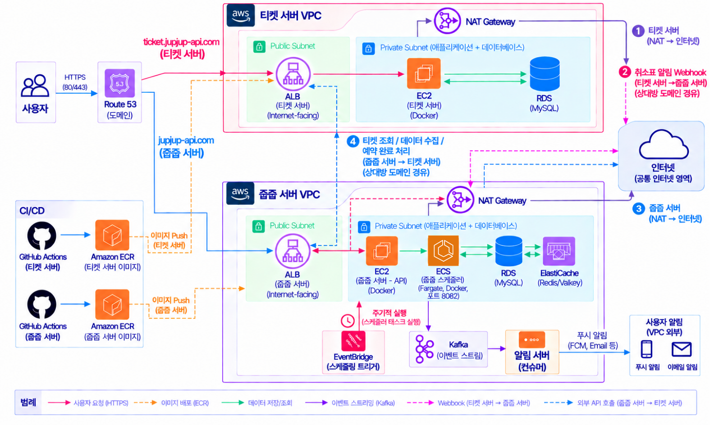
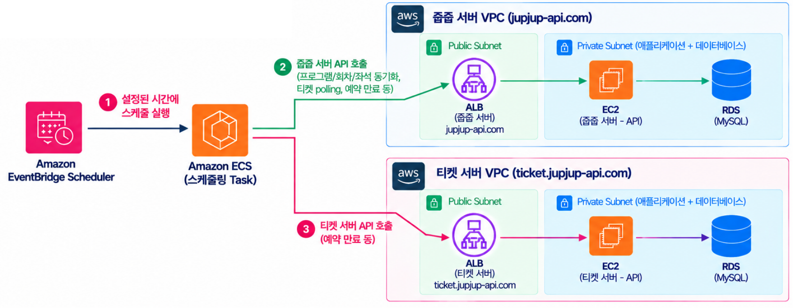
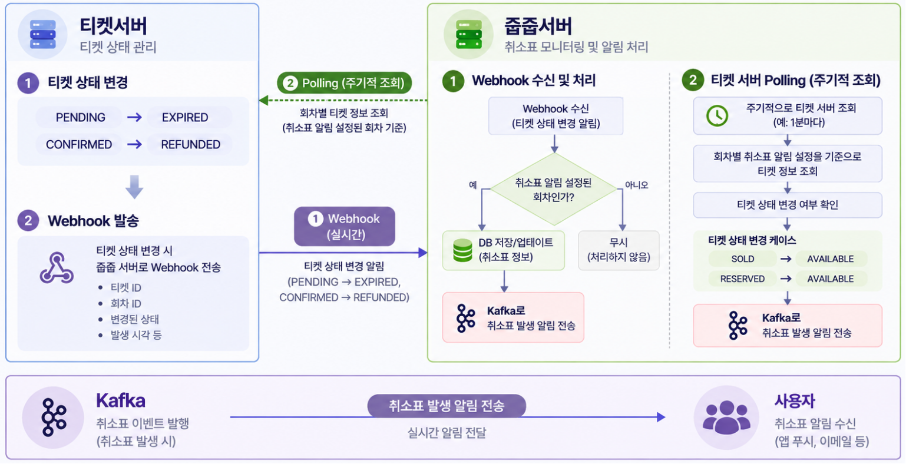

# 🎫 JupJup

<p align="center">
  <b>매진된 공연/기차표, 포기해야할까?<br>
  놓친 티켓을 줍는 취소표 감지 및 알림 서비스
  </b>
</p>

<p align="center">
  
  
  
  
  
  
</p>

<br>

## 📌 프로젝트 소개

인기 공연은 빠르게 매진되지만 예약 또는 결제 취소로 인해  
좌석이 다시 판매 가능한 상태가 되는 경우가 있습니다.

JupJup은 사용자가 직접 반복해서 좌석을 확인해야 하는 불편을 줄이기 위해  
취소표 발생을 감지하고, 알림을 신청한 사용자에게 정보를 전달하는 서비스입니다.

| 항목 | 내용 |
|---|---|
| 개발 기간 | `2026.08.27 ~ 2026.09.17` |
| 개발 인원 | `[4명]` |
| 프로젝트 형태 | `[팀 프로젝트]` |
| 구현 범위 | `[백엔드]` |

<br>


### 👥 Developer

| 박주희 | 박준용 | 김예슬 | 최형석 |
| :---: | :---: | :---: | :---: |
| <a href="https://github.com/heeheepark"></a> | <a href="https://github.com/juntori"></a> | <a href="https://github.com/mirumeow"></a> | <a href="https://github.com/Hseok-2"></a> |

<br>

### 🔗 Repository

| Repository | 역할 |
|---|---|
| [jupjup-api](https://github.com/ticket-jup-jup/jupjup-api) | **줍줍서버** : 사용자, 취소표 구독, 예약·결제 및 알림 처리를 담당하는 메인 API 서버 |
| [jupjup-ticket-server-api](https://github.com/ticket-jup-jup/jupjup-ticket-server-api) | **티켓서버** : 공연·회차·티켓 및 예약 상태를 관리하는 가상 티켓 서버 |
| [jupjup-scheduler](https://github.com/ticket-jup-jup/jupjup-scheduler) | **스케줄러서버** : 데이터 동기화, Polling, 예약 만료 등의 주기적 작업을 수행하는 스케줄링 서버 |

<br>

---

## ✨ 주요 기능

기능 | 구현 내용 | 담당 애플리케이션 |
| :--- | :--- | :--- |
| 사용자 인증 | 회원가입, BCrypt 비밀번호 해싱, JWT 로그인 | 메인 API |
| 계정 관리 | 비밀번호 변경, 회원 탈퇴, 티켓 서버 계정 검증·연동 | 메인 API ↔ 티켓 서버 |
| 공연 데이터 제공·동기화 | 프로그램·공연 회차·좌석 정보 제공 및 메인 API에 동기화 | 티켓 서버 → 메인 API |
| 티켓 조회 | 회차·상태 기반 목록 및 단건 조회 | 메인 API |
| 취소표 구독 | 회차별 구독 생성, 내 구독 조회, 구독 해제·재활성화 | 메인 API |
| 취소표 감지 | Webhook 수신 및 활성 구독 회차의 티켓 Polling | 메인 API ↔ 티켓 서버 |
| 알림 | Kafka 이벤트 소비 후 구독자별 알림 저장, 내 알림 조회 | 메인 API |
| 임시 예약 | 티켓 서버 계정 연동 확인 후 10분 유효 임시 예약 생성 | 메인 API ↔ 티켓 서버 |
| 예약·결제 관리 | 내역 조회, 예약 취소, 결제 상태 처리·예약 확정, 환불 상태 처리 | 메인 API ↔ 티켓 서버 |
| 만료 처리 | 각 서버의 결제 대기 예약을 만료 상태로 전환 | 스케줄러 → 각 API


<br>

---

## 🔄 Service Flow

사용자가 취소표 알림을 설정한 이후 취소표 감지, 알림, 예약 및 결제까지 이어지는 전체 서비스 흐름입니다.

<p align="center">
  
</p>

취소표는 Webhook과 Polling을 통해 감지하며, 감지된 취소표 이벤트는 Kafka를 통해 알림 처리 영역으로 전달됩니다.


---

## 🏗 System Architecture


<p align="center">
  
</p>

JupJup은 실제 예매 서비스를 가정한 **티켓 서버**와  
취소표 모니터링 및 알림을 담당하는 **줍줍 서버**를 분리하여 구성했습니다.<br>
여기에 데이터 동기화를 위한 **스케줄러 서버**를 추가했습니다.

### Ticket Server
- 티켓 및 예약 상태 관리
- 티켓 조회 API 제공
- 티켓 상태 변경 시 Webhook 전달
- 임시 예약 및 예약 확정 API 제공

### JupJup Server
- 사용자 및 취소표 알림 구독 관리
- Webhook 이벤트 수신
- Polling을 통한 티켓 상태 확인
- 취소표 이벤트 발행
- 예약 및 결제 요청 처리

### Scheduler Server

- 주기적인 데이터 동기화
- 취소표 확인을 위한 Polling
- 예약 만료 처리
- 주기적으로 실행되어야 하는 작업 관리

<br>
티켓 서버, 줍줍 서버는 각각 MySQL 데이터를 관리합니다. <br> 
스케줄러는 DB를 직접 수정하지 않고 각 서버의 API를 호출합니다.


## ⏱ Scheduler Architecture

주기적으로 실행할 작업의 트리거를 메인 API와 분리하고,  
**Scheduler Server가 작업별 내부 API를 호출**하도록 구성했습니다.


<p align="center">
  
</p>


 **Amazon EventBridge Scheduler → ECS Task → Scheduler Server**
EventBridge Scheduler가 설정된 시간에 ECS Task를 실행하면, 스케줄러는 `JOB_TYPE`에 따라 각 API를 호출한 뒤 종료합니다.

### 주요 스케줄링 작업

| 작업 | JOB_TYPE | 호출 대상 |
| :--- | :--- | :--- |
| 프로그램 정보 동기화 | `PROGRAM_SYNC` | 줍줍 서버 |
| 공연 회차·좌석 정보 동기화 | `PERFORMANCE_SEAT_SYNC` | 줍줍 서버 |
| 구독 회차의 티켓 Polling | `TICKET_POLLING` | 줍줍 서버 |
| 티켓 서버의 임시 예약 만료 | `RESERVATION_EXPIRE` | 티켓 서버 |
| 줍줍 서버의 임시 예약 만료 | `RESERVATION_EXPIRE_JUPJUP` | 줍줍 서버 |


<br>
---

## 🔔 Core Feature - 취소표 감지

JupJup은 **Webhook과 Polling을 함께 활용하여 취소표 발생을 감지**합니다.

<p align="center">
  
</p>

### Webhook

Ticket Server에서 티켓 상태가 변경되면  
JupJup API Server로 상태 변경 이벤트를 전달합니다.

```text
Ticket Server
      │
      │ Ticket Status Changed
      ▼
   Webhook
      │
      ▼
JupJup API Server
      │
      ▼
취소표 감지
```

### Polling

Scheduler Server가 주기적으로 Ticket Server를 조회하여  
알림이 설정된 회차의 티켓 상태 변화를 확인합니다.

```text
Scheduler Server
      │
      ▼
Ticket Server 조회
      │
      ▼
티켓 상태 확인
      │
      ▼
취소표 감지
```

### Event Processing

Webhook 또는 Polling을 통해 감지된 취소표 정보는  
Kafka를 통해 이벤트로 전달됩니다.

이후 해당 공연의 취소표 알림을 구독한 사용자를 조회하고  
알림을 전달합니다.
```text
Webhook / Polling
       │
       ▼
  취소표 이벤트
       │
       │ 트랜잭션 커밋 후 발행
       ▼
     Kafka
       │
       ▼
 알림 Consumer
       │
       ▼
 구독자별 알림 저장
       │
       ▼
 사용자 알림 조회
```
<br>

---
